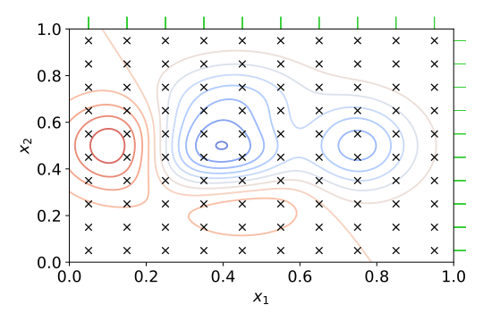

# General Concepts

## Table of contents
1. [Data Splitting (Train-Test Split)](#train-split)
    1. [Train](#train)
    1. [Testing](#test)
    1. [Holdout](#holdout)
    1. [Whole Process](#whole-process)
1. [Cross Validation](#cv)
1. [Supervised Learning](#supervised)
    1. [Supervised Learning Algorithms](#supervised-algorithms)
    1. [Pros/Cons](#supervised-pc)
1. [Unsupervised Learning](#unsupervised)
    1. [Unsupervised Learning Algorithms](#unsupervised-algorithms)
    1. [Pros/Cons](#unsupervised-pc)
1. [Hypertuning](#hypertuning)
    1. [Grid Search](#grid-search)
    1. [Random Search](#random-search)
    1. [Bayesian optimization](#bayesian-optimization)
    1. [Random Search](#random-search)
1. [Additional Resources](#additional-resources)  

## Introduction

---

This section will cover more general concepts in machine learning that is applicable to all types of models. This will include topics such as: train-test split, cross-validation, supervised/unsupervised models, etc. These are fundamental concepts required to understand the other sections.

## Data Splitting (Train-Test Split)

---

**Definition:**  
>`Data splitting` is when a dataset is split into two or more subsets. Typically, a dataset is split into: **training**, **validation** (Sometimes known as **testing**.), and **holdout** (Sometimes also called **testing**! We will be strictly referring this dataset as the holdout.) Yes, it can get confusing. An example of data split could be 60%, 20%, 20%, (Train, test, holdout). 

All 3 bars added together is the original dataset. 

### Training

>The `train` dataset is the dataset used to train the model. Simple enough.

### Validation (Testing)

>The `Validation` dataset is used to determine how well the model is doing. This dataset can be used to help tune the hyper parameters within a model. This dataset is sometimes known as the testing data. Be careful as this is separate from the holdout data in the next section. 

### Holdout 

>The `Holdout` dataset is data that the model has never "seen" before. This is data that is set aside **before** the model is trained. The holdout dataset can be used to compare different models to see how well a model is doing. The holdout dataset can be thought of as a sample of "actual/real world" data the model will be used on. 

### Whole Process

Generally, the process looks like the following:

* Data is split into two groups. A training and holdout dataset.
* The training dataset is further split into training and validation.
* The model is trained on the training set.
* The model is tuned on the validation set.
* Repeat training and tuning with other types of models.
* Compare models by comparing accuracy with predicting on the test set.
* Pick the best model and deploy.

## Cross Validation

---

**Definition:**  
>`Cross-validation` is a resampling procedure used to evaluate machine learning models on a limited data sample. There are different types of cross-validation methods. For example: **K-folds**, or **Leave-one-out**. Instead of a traditional train-test-holdout, it becomes cross-validation-holdout. 

>In **K-folds cross-validation**, the dataset is split into k different "blocks". One block is treated as the validation, and the rest is the training. This is repeated until all blocks are used. **Leave-one-out** is similar to k-folds. However, instead of blocks, each individual row is treated as a "block". As a tradeoff, this method takes a long time to run. 

  

Example of 4-fold cross validation. (K = 4)

Some other cross-valid methods are **stratified cross-validation** and **time series cross-validation**

## Supervised Learning

---

>As the name implies, `Supervised Learning` is the type of machine learning where models are trained using well "labeled" data. `Labeled data` just simply means that the input data is already marked with the correct output. For example, if we were to predict images of cats and dogs. We would have a folder of all cat pictures with the label of "cat", and a folder of all dog images with the label of "dog". 

  

In this example provided by Javatpoint, the labeled data is "Hexagon", "Triangle" and "Square". These used to train the model. Test data, which are inherently unlabeled, would be predicted on. The model would (hopefully) provide us the correct labels. 

### Supervised Learning Algorithms  

Some of the commonly used supervised machine learning algorithms are as follows:  
1. Linear Regression
1. Logistic Regression
1. Support Vector Machine (SVM)
1. K-Nearest Neighbors (KNN)
1. Decision Trees (CART)
1. Random Forests
1. Neural Networks* (NN)

\* Some neural networks can be unsupervised.

### Pros & Cons  

### Pros:  
    * Simple process. How the model is learning is relatively understood and explainable. 
    * The classes/input data is known. Exact classes are known.
    * Very helpful in real world problems. E.g. Classification problems such as detecting fraud. Or predicting a numeric target.

### Cons:  
    * Requires a labeled dataset.
        * Sometimes this can be very costly. Manual labor may be necessary.
    * Supervised learning cannot provide unknown information/insights from the training data. 

## Unsupervised Learning

---

>`Unsupervised Learning` is the type of machine learning where models are not supervised using training data. Instead, models itself find hidden patterns and insights from the given data without human intervention. Some ideal use cases are for exploratory data analysis, customer segmentation, image recognition and cross-selling strategies.   

  

In this example provided by Javatpoint, the data provided is unlabeled. The algorithm has to interpret the provided data and then process the outputs. Ideally, it will discover distinct features in the images that separates the dog images from cat images. 

### Unsupervised Learning Algorithms  

Some of the commonly used Unsupervised machine learning algorithms are as follows:  
1. K-means
1. Clustering (General)
1. Hierarchal Clustering
1. Principle Component Analysis (PCA)
1. t-distributed Stochastic Neighbor Embedding (t-SNE)
1. Neural Networks

### Pros & Cons  

### Pros:  
    * Does not require labeled input data.
    * Can provide new insights on datasets that might not be known.
        * "Digs" up hidden patterns.

### Cons:  
    * Acts like a "black box". The inputs are known, but the general method is unknown. Hard to explain in human terms. 
        * Not always certain the results are useful. 
    * Can be less accurate as there are no labeled input data to train from.  
    * Complexity increases as additional features are added. 

## Hypertuning

---

>`Hyperparameter Optimization` or more often known as `Hypertuning` is the problem of choosing a set of optimal hyperparameters for a learning algorithm. Hyperparameters contain the data that govern the training process itself. Hyperparameters cannot be directly trained from the data. They are learned during training when the loss function is optimized. 

Some examples of hyperparameters are:  
* What should the maximum depth be for a decision tree.
* What are the minimum # of samples required at a leaf node for a decision tree.
* How many trees should be grown in a random forest.
* How many neurons in a neural network layer.
* What should the learning rate be for a gradient descent?

There are several methods that can be used.

### Grid Search

>`Grid Search` is one of the most basic hyperparameter turning method. Essentially we build a model for each possible combination of all the hyperparameter values provided, evaluate each model and select the model that produces the best result. The trade off is that this method is exhaustive and can be inefficient. 

Grid Search Animated            |  Grid Search Graph
:-------------------------:|:-------------------------:
  |  
Image courtesy of [SigOpt](https://sigopt.com/blog/common-problems-in-hyperparameter-optimization) | Image courtesy of [Wikipedia](https://en.wikipedia.org/wiki/File:Hyperparameter_Optimization_using_Grid_Search.svg)

### Random Search  

>In a `Random Search` method, unlike Grid Search, a discrete set of values is no longer provided. Instead, a statistical distribution for each hyperparameter is provided from which values may be randomly sampled. One reason to use Random Search over Grid Search is that hyperparameters are equally important. Although this may not always be the case, the assumption holds true for most datasets.   

Random Search Animated            |  Random Search Graph
:-------------------------:|:-------------------------:
  |  
Image courtesy of [SigOpt](https://sigopt.com/blog/common-problems-in-hyperparameter-optimization) | Image courtesy of [Wikipedia](https://en.wikipedia.org/wiki/File:Hyperparameter_Optimization_using_Random_Search.svg)

### Bayesian Optimization

>The prior two methods esssentially are performed in isolation. (i.e. Individual experiments building model with various hyperparameter values and record the model performance for each.) One downside is that information from one experiment cannot be brought into the next. `Bayesian Optimization`, on the other hand, is known as a **sequential model-based optimization (SMBO)**. These types of optimization methods allow one to use the result of a previous iteration to improve the next.  

Bayesian Optimization Animated            |  Bayesian Optimization Graph
:-------------------------:|:-------------------------:
  |  
Image courtesy of [SigOpt](https://sigopt.com/blog/common-problems-in-hyperparameter-optimization) | Image courtesy of [Wikipedia](https://en.wikipedia.org/wiki/File:Hyperparameter_Optimization_using_Tree-Structured_Parzen_Estimators.svg)

## Additional Resources

---

WIP